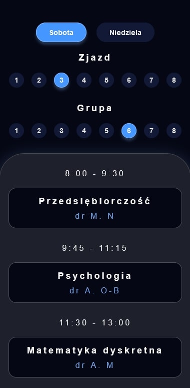
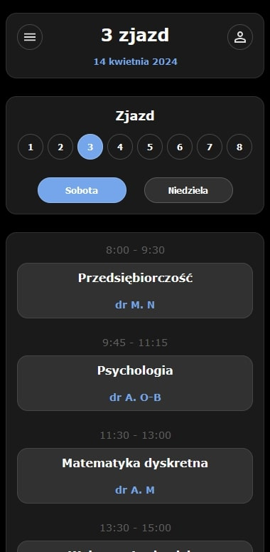

# UniSchedule

## Mobile web app for students to check planned lectures and exercises.
The idea for this project originated from the frustration with the unreadable schedule provided to students. 

This is the second version of the project, allowing me to improve and modernize the interface while also giving me a chance to practice using **Styled Components**.

As the new semester begins, I saw it as an opportunity to refresh the design and experiment with the "bento" design approach. 🍱

## Demo
🔗 [Finished website](https://dag-szad.github.io/UniSchedule/)

## Tech Stack
🔨 **HTML**, **CSS** with **Styled Components**, **Java Script** and **React**.

## Screenshots
| Before | After |
|--------|-------|
|  |  |

## Authors
- Dag
    - [Linkedin](https://www.linkedin.com/in/dagmara-szadkowska-708423255)
    - [GitHub](https://www.github.com/dag-szad)

## Feedback
If you have any feedback, comments, tips, please reach out to me at LinkedIn. 🤗